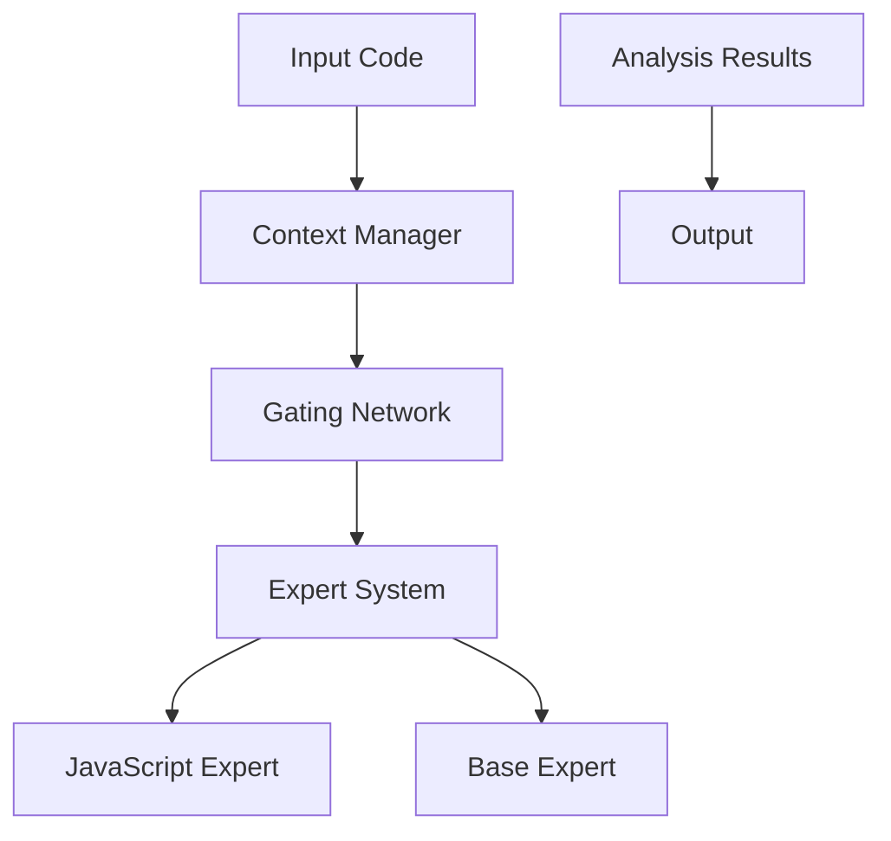

# Implementation Details 🛠

## 📑 Table of Contents

- [Architecture Overview](#architecture-overview)
- [Components](#components)
- [Technical Decisions](#technical-decisions)
- [Data Flow](#data-flow)
- [Testing Strategy](#testing-strategy)

## 🏗 Architecture Overview

The Code Reviewer is built on a modular architecture that separates concerns into distinct components:



## 🧩 Components

### Context Manager (`src/context/ContextManager.ts`)

The Context Manager is responsible for:
- Code parsing and AST generation
- Maintaining analysis context
- Token management and tracking
- Scope resolution

### Gating Network (`src/gating/GatingNetwork.ts`)

The Gating Network:
- Routes analysis requests to appropriate experts
- Manages expert selection logic
- Handles priority and weighting of different analyses
- Coordinates parallel processing

### Expert System

#### Base Expert (`src/experts/BaseExpert.ts`)
- Provides common analysis capabilities
- Implements core review logic
- Defines expert interface

#### JavaScript Expert (`src/experts/JavaScriptExpert.ts`)
- Language-specific analysis
- Pattern recognition
- Best practice enforcement

## 🔧 Technical Decisions

### TypeScript Usage
- Strong typing for maintainability
- Interface-driven development
- Enhanced IDE support
- Better refactoring capabilities

### Testing Strategy
- Unit tests for individual components
- Integration tests for system flow
- Custom test runners for specific scenarios

## 🔄 Data Flow

1. **Input Processing**
   ```typescript
   interface CodeInput {
     content: string;
     language: string;
     context?: AnalysisContext;
   }
   ```

2. **Context Analysis**
   ```typescript
   interface AnalysisContext {
     scope: ScopeTree;
     imports: ImportMap;
     exports: ExportMap;
   }
   ```

3. **Expert Processing**
   ```typescript
   interface ExpertResult {
     suggestions: Suggestion[];
     confidence: number;
     metadata: ResultMetadata;
   }
   ```

## 🧪 Testing Strategy

### Unit Testing
- Component isolation
- Mocked dependencies
- Comprehensive coverage

### Integration Testing
- End-to-end workflows
- Cross-component interaction
- Performance benchmarking

### Custom Test Runners
Located in `test/`:
- `analyze-code.js`: Code analysis testing
- `run-test.js`: General test execution
